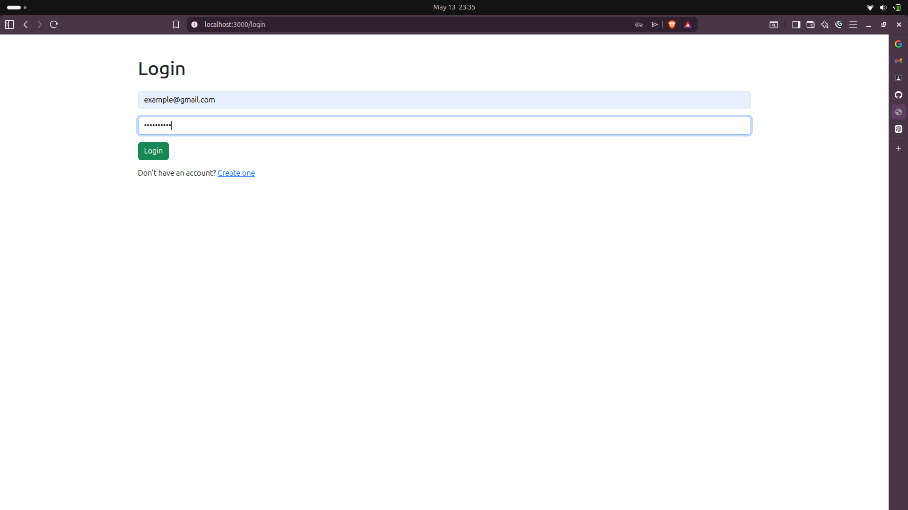
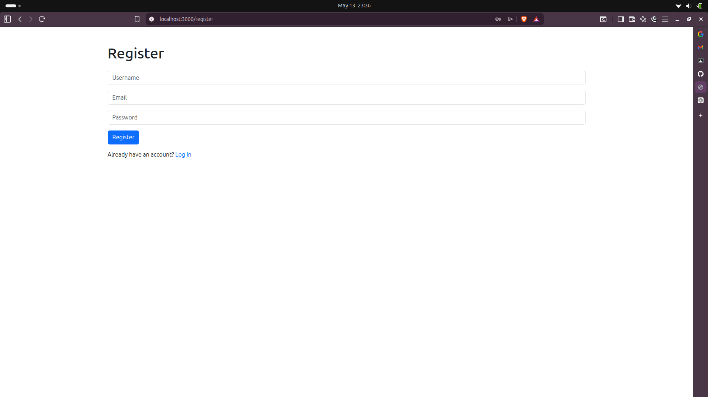
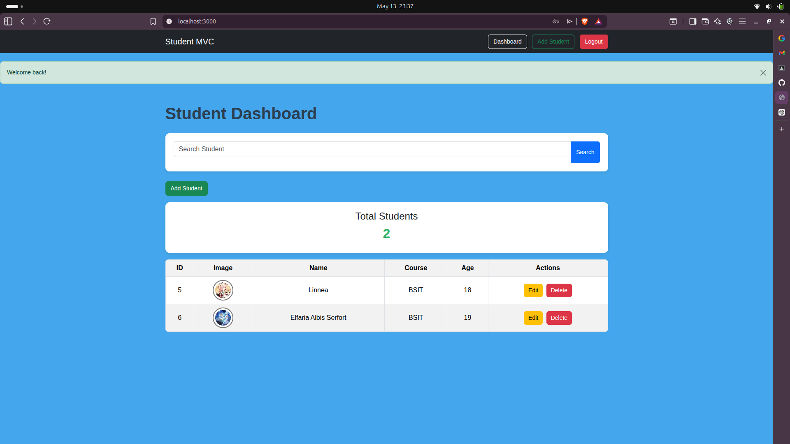
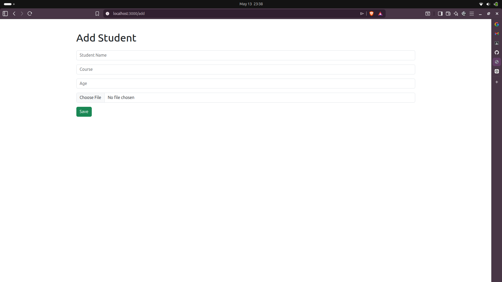
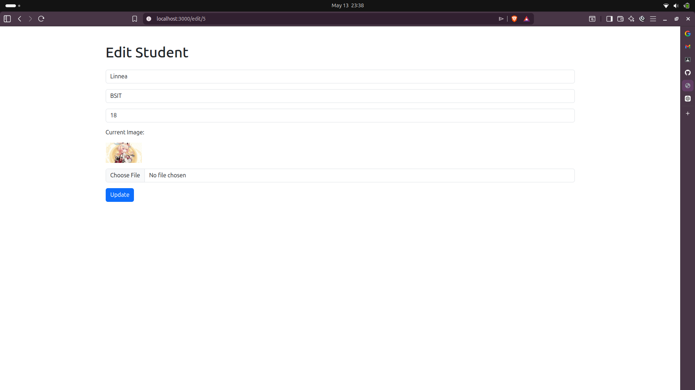
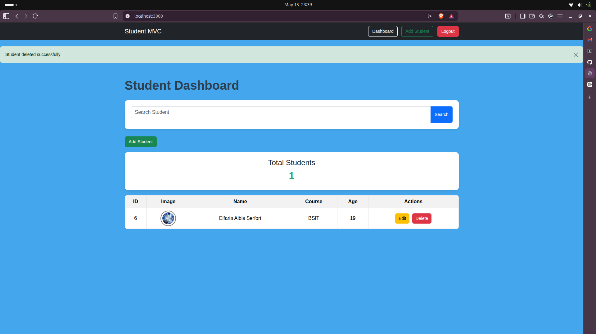

# Student Management System

A full-stack MVC-based Student Management System developed using Node.js, Express.js, MySQL, EJS, and Bootstrap.

This project was developed as part of the laboratory activities for Integrative Programming and Technologies (PC2204). The application demonstrates the implementation of the MVC (Model-View-Controller) architecture with authentication, CRUD operations, image uploads, search functionality, and database integration.

---

# Features

## Authentication System
- User Registration
- User Login
- Session-based Authentication
- Logout Functionality
- Password Hashing using bcrypt

## Student Management
- Add Student
- Edit Student
- Delete Student
- Search Students
- Upload Student Images
- Dashboard with Total Student Count

## Security Features
- Helmet Security Middleware
- Session Protection
- Input Validation
- Password Encryption
- File Type Validation for Uploads

## Database Features
- MySQL Database Integration
- User Table
- Student Table
- CRUD Database Operations

---

# Technologies Used

## Backend
- Node.js
- Express.js
- MySQL2

## Frontend
- EJS
- Bootstrap 5
- HTML5
- CSS3

## Security & Middleware
- bcryptjs
- express-session
- connect-flash
- multer
- helmet
- express-validator
- dotenv

## Development Tools
- Visual Studio Code
- Git
- GitHub
- Nodemon

---

# MVC Architecture

The application follows the MVC (Model-View-Controller) architecture.

## Models
Responsible for:
- database operations
- SQL queries
- data processing

Files:
- `models/User.js`
- `models/Student.js`

## Views
Responsible for:
- user interface
- displaying pages
- rendering dynamic data

Files:
- `views/auth/`
- `views/students/`
- `views/partials/`

## Controllers
Responsible for:
- handling requests
- processing logic
- returning responses

Files:
- `controllers/authController.js`
- `controllers/studentController.js`

## Routes
Responsible for:
- endpoint management
- URL routing

Files:
- `routes/authRoutes.js`
- `routes/studentRoutes.js`

---

# Project Structure

```bash
student-management-system/
│
├── config/
│   └── db.js
│
├── controllers/
│   ├── authController.js
│   └── studentController.js
│
├── middleware/
│   ├── authMiddleware.js
│   └── uploadMiddleware.js
│
├── models/
│   ├── Student.js
│   └── User.js
│
├── public/
│   ├── uploads/
│   ├── css/
│   └── js/
│
├── routes/
│   ├── authRoutes.js
│   └── studentRoutes.js
│
├── views/
│   ├── auth/
│   ├── students/
│   └── partials/
│
├── .env
├── app.js
├── package.json
└── README.md
```

---

# Installation Guide

## 1. Clone the Repository

```bash
git clone https://github.com/maxinehabac/student-management-system.git
```

---

## 2. Open Project Folder

```bash
cd student-management-system
```

---

## 3. Install Dependencies

```bash
npm install
```

---

## 4. Configure Environment Variables

Create a `.env` file:

```env
DB_HOST=localhost
DB_USER=root
DB_PASSWORD=yourpassword
DB_NAME=studentmvc
SESSION_SECRET=supersecretkey
PORT=3000
```

---

## 5. Import Database

Run the SQL script:

```sql
CREATE DATABASE studentmvc;

USE studentmvc;

CREATE TABLE users (
    id INT AUTO_INCREMENT PRIMARY KEY,
    username VARCHAR(100),
    email VARCHAR(100) UNIQUE,
    password VARCHAR(255)
);

CREATE TABLE students (
    id INT AUTO_INCREMENT PRIMARY KEY,
    name VARCHAR(100),
    course VARCHAR(100),
    age INT,
    image VARCHAR(255)
);
```

---

## 6. Run the Application

```bash
node app.js
```

or

```bash
npx nodemon app.js
```

---

# Screenshots

## Login Page



---

## Register Page



---

## Dashboard



---

## Add Student



---

## Edit Student



---

## Delete Student



---

# Search Functionality

The application includes a search feature that allows users to search students by:
- Name
- Course
- Age

Example:

```sql
SELECT * FROM students
WHERE
    name LIKE '%keyword%'
    OR course LIKE '%keyword%'
    OR age LIKE '%keyword%'
```

---

# Image Upload System

The application uses Multer middleware for image uploads.

Supported image formats:
- JPG
- JPEG
- PNG
- GIF

Uploaded images are stored in:

```bash
/public/uploads
```

---

# Security Implementations

The application includes the following security features:

- Password hashing using bcrypt
- Helmet middleware
- Session authentication
- Protected routes
- File upload validation
- Input validation using express-validator

---

# Git Version Control

## Initialize Git

```bash
git init
```

## Add Files

```bash
git add .
```

## Commit Changes

```bash
git commit -m "Initial project setup"
```

## Push to GitHub

```bash
git push -u origin main
```

---

# Testing and Debugging

The project was tested using:
- browser developer tools
- terminal logs
- Visual Studio Code debugging tools

Testing included:
- CRUD operations
- login authentication
- image uploads
- search functionality
- session protection

---

# Challenges Encountered

Some challenges encountered during development include:
- implementing session authentication
- handling image uploads using multer
- deleting uploaded images automatically
- organizing MVC architecture properly
- integrating MySQL with Express.js

Solutions were implemented through debugging, middleware configuration, and improved route handling.

---

# Future Improvements

Possible future enhancements:
- pagination
- sorting functionality
- responsive admin dashboard
- REST API integration
- role-based authentication
- student profile pages
- advanced search filters

---

# Developers

Developed by:

- Maxine Rhone Habac
- Rhea Mae Vallestero
- Jamaica Lomocso
- Mary Ruth Vallestero

Course:
PC2204 – Integrative Programming and Technologies

---

# License

This project is for educational purposes only.
